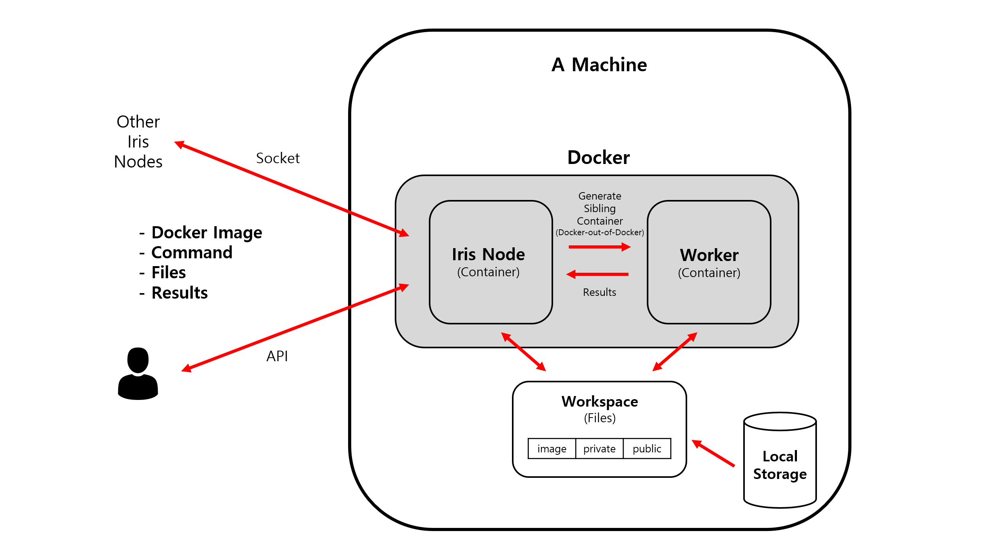

# Iris Network

Iris Network is a multipurpose docker-based socket network platform.

Main use cases are distributed code executions. (Federated Learning, Working with distributed data, etc.)

## Concept

This diagram shows the interactions in the point of view of an Iris Node which is installed in a single machine.

### Iris Network

Iris Network is a virtual network formed by continuously communicating Iris Nodes created for distributed code executions.
The codes to be executed should be packaged as a Docker image.

### Iris Node

An Iris Node is simply a Docker container.
To form an Iris Network, no other components are needed than Iris Nodes.
It communicates with other Iris Nodes to send and receive commands.
Each Iris Node is connected to the device's Docker engine using Docker-out-of-Docker to create containers and execute intended codes.
An Iris Node can create or join an Iris Network.

### Genesis Node

A Genesis Node is an Iris Node which created an Iris Network.
The Network Config is uploaded to the Genesis Node from the Network Create API.

### Network Config

Each Iris Network has its configurations.

- `name`: Name of Iris Network used in messages.
- `mode`: Only `master_slave` mode is supported.
- `key`: Secret key used for authentication when joining a network.

### Network Map

Each Iris Network has a map of connected Iris Nodes.
Is is not manually configured by the user, but automatically generated as a node joins or leaves the network.
This is used to figure out which Iris Nodes to communicate with.

Each Iris Node has the below properties.
- `name`: Name of Iris Node used for identification.
- `ip`: An IP address so that other nodes can join the network through this node.
- `apiPort`: A port used by the Control API.
- `socketPort`: A port used for inter node communications.
- `role`: `master` or `slave` in `master_slave` mode.

### Workspace

The Workspace is a directory that is shared by the Iris Node and the machine using Docker Volumes.
This directory will automatically be mounted as a volume to worker containers created by the API.
The Workspace is divided into 3 subdirectories.

- `image` directory: Docker image files that will be loaded to Docker.
- `private` directory: Contains files that can only be used in an Iris Node and cannot be shared with other Iris Nodes.
- `public` directory: Used for sharing files between Iris Nodes using the Control API.

The recommended way to use the Workspace is loading sensitive data from a machine into the Private directory, and save the computed outputs to the Public directory to gather only the results while protecting the original data.

## How to run

[HowToRun.md](docs/HowToRun.md)

## Control API

[ControlAPI.md](docs/ControlAPI.md)

## Socket Events

[SocketEvents.md](docs/SocketEvents.md)

## Example

[Example.md](docs/Example.md)
