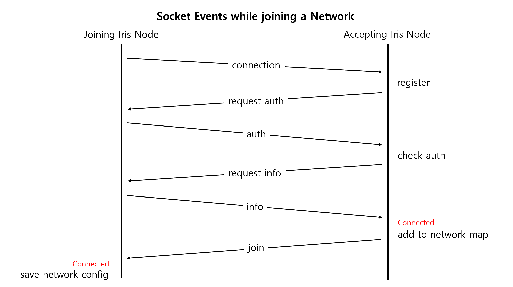

# Socket Events

Socket Events are the protocols of communications between Iris Nodes.

## Socket Events while joining a Network

When an Iris Node tries to join an existing Iris Network, the below events are used.

- `requestAuthEvent`
- `authEvent`
- `requestInfoEvent`
- `infoEvent`
- `joinEvent`

## Other Socket Events

- `commandEvent`: Sent for Docker related executions. 
- `fileSaveEvent`: Sent when files are being sent.
- `fileFetchEvent`: Sent when files are being fetched.
- `messageEvent`: Used for debug purpose messages.
